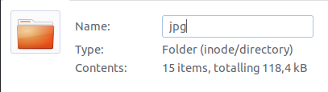
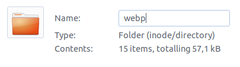

# Batch to WebP

Bulk optimizing image from png or jpg for your website using `cwebp` command tool, simplify with this small script.

## How to use

**Preparation:**

I use Ubuntu, you can easily suit this solution in your environment.

```bash
$ sudo apt install cwebp
```

**Use this script**

Put this script to your directory and run this

```
$ mv batch_to_webp.sh your_directory
$ chmod +x batch_to_webp.sh
$ ./batch_to_webp.sh jpg
```

You can change `jpg` with `png`

## Expanding this script

Currently, this script only can use in the same directory. The output image has ~75% of original quality and cut ~50% of original size. The webp images on the webp directory.





**Please enjoy this script and having fun.**